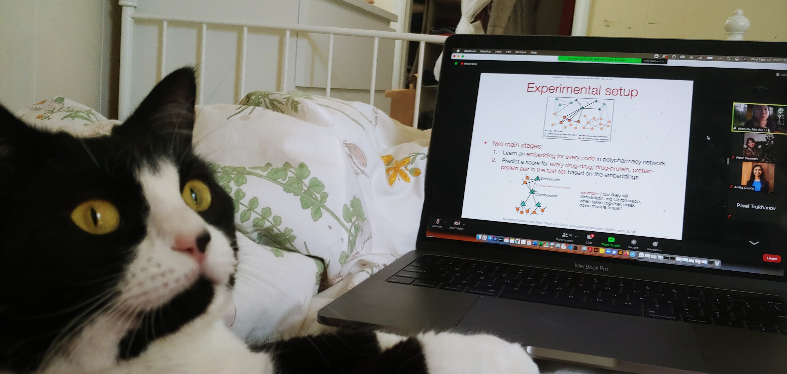
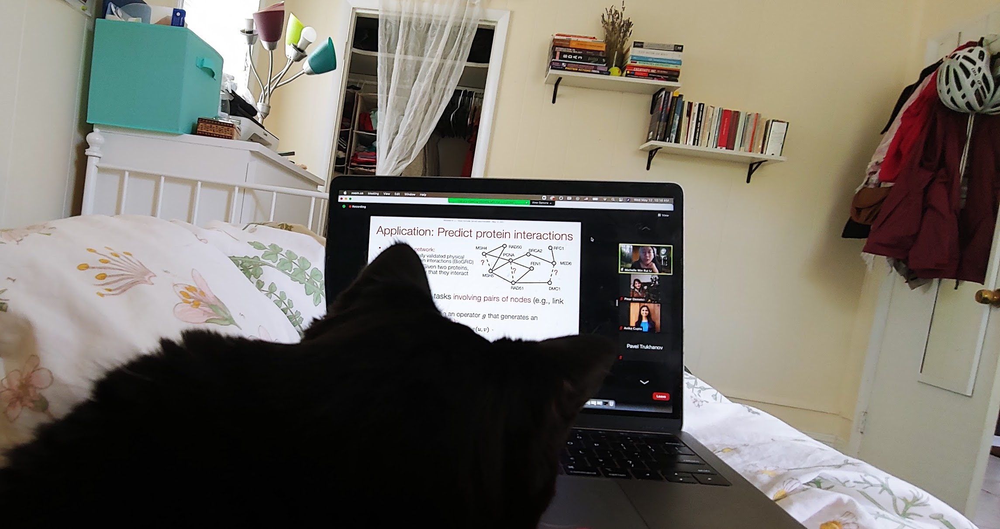
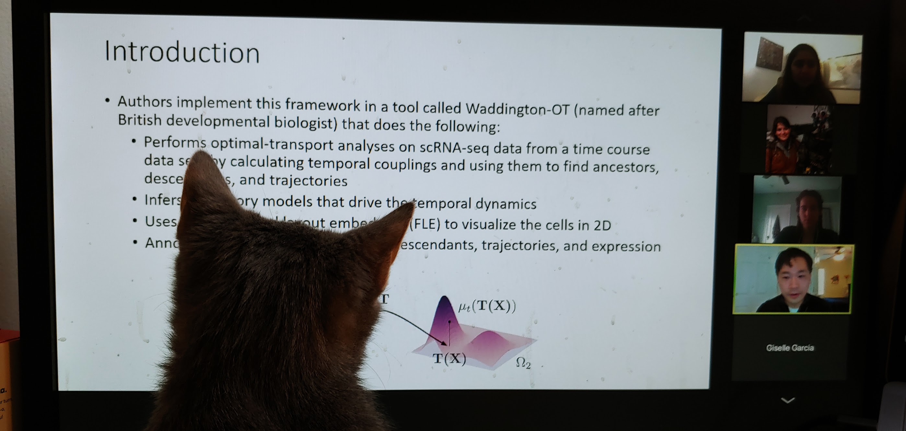
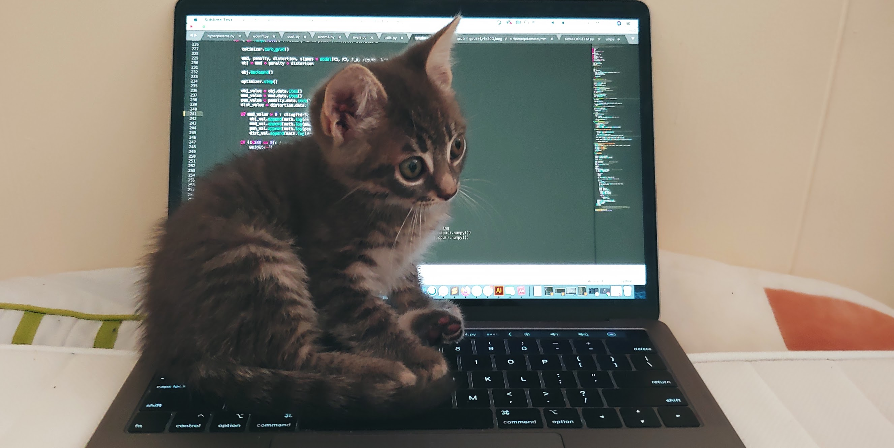

# Fun and Hobbies

#### Boardgames with friends
My favorite pastime is playing boardgames with friends. And thanks to Covid-19 vaccines, we are now able to do that in person again! :)  
{:height="300px"} 
*My college friends and I playing [Meeple Circus](https://boardgamegeek.com/boardgame/193214/meeple-circus) -- 07/19/2021 Somerville,MA*

#### Foster cats
As we all know, mentorship matters. In my spare time, one of the things I like to do is introduce our foster cats to the world of computational biology. Two of them decided that this is indeed the field for them!

Here, you can find Kitty join a virtual presentation with me and learn about the applications of graph neural networks for modeling protein-protein interactions: 

{:height="200px"}
{:height="200px"}  

And here, you can find Wheezy listen to my [labmate Jeremy](https://rsinghlab.org/) present the [WaddingtonOT](https://www.cell.com/cell/pdf/S0092-8674(19)30039-X.pdf) paper (left), and take (somewhat lukewarm) interest in coding (right):

{:height="200px"}
{:height="200px"}

<table class="table table-hover">
  
    
    <tr>
      <td><a href="{{ post.url }}">{{ post.title }}</a></td>
      <td class="col-md-3" style="text-align: right;">{{ post.date | date: "%B %e, %Y" }}</td>
    </tr>
    
  
</table>