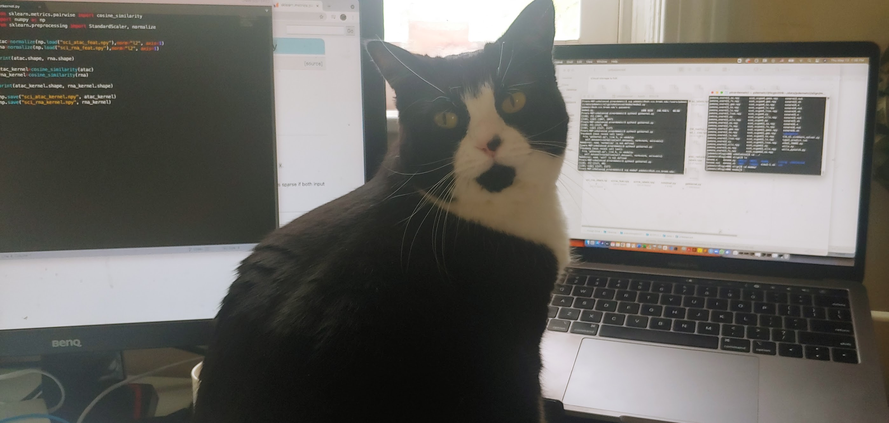

# Projects
Coming soon.

<html>

  

    
  

  1

  
2

  
3

  
4

  
5

  
6

  
7

  
8

  
9

  
10

  
11

  
12

</html>

<table class="table table-hover">
  
    
    <tr>
      <td><a href="{{ post.url }}">{{ post.title }}</a></td>
      <td class="col-md-3" style="text-align: right;">{{ post.date | date: "%B %e, %Y" }}</td>
    </tr>
    
  
</table>